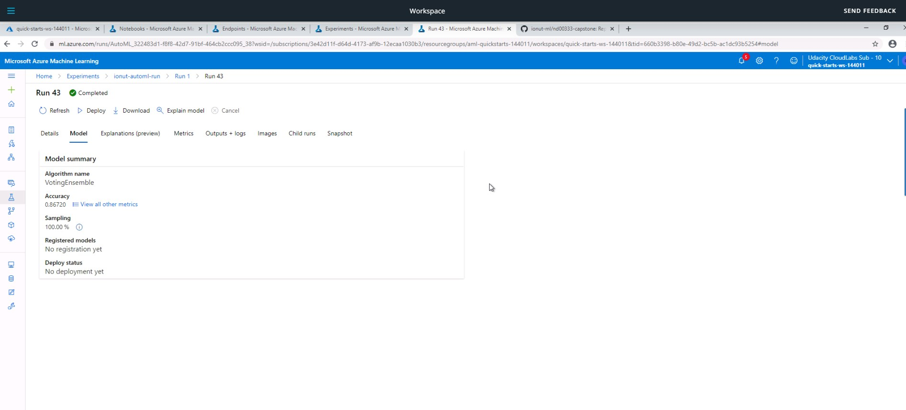
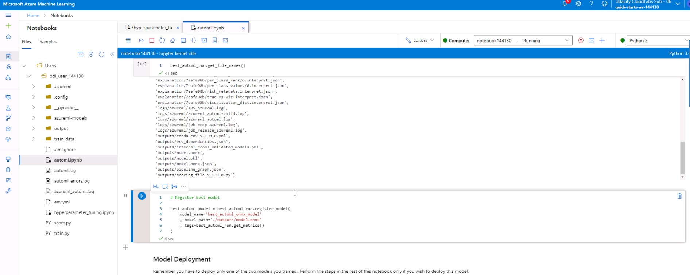
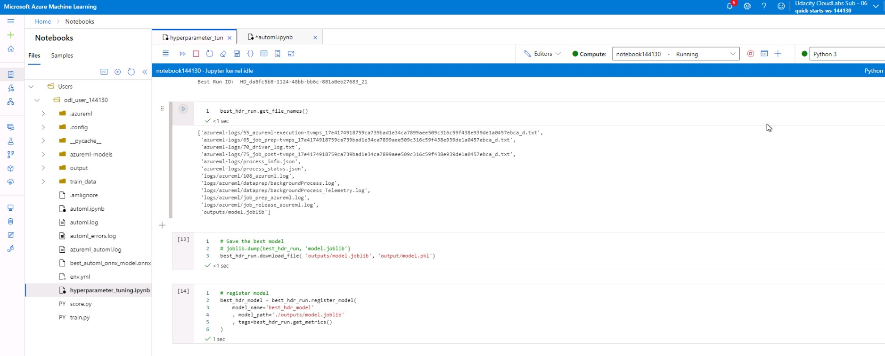
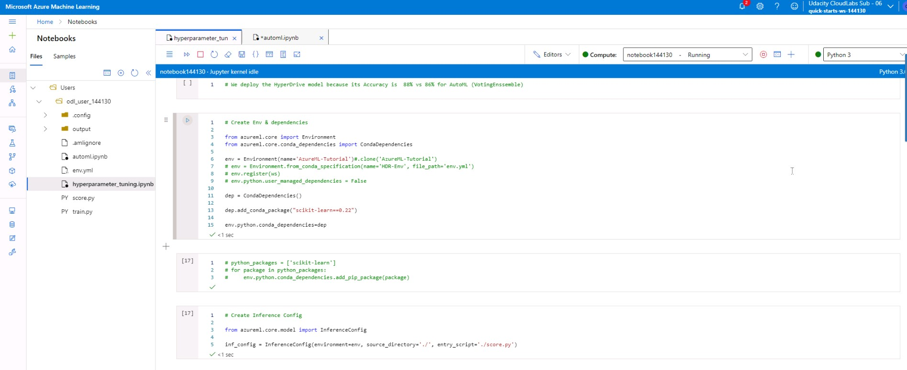
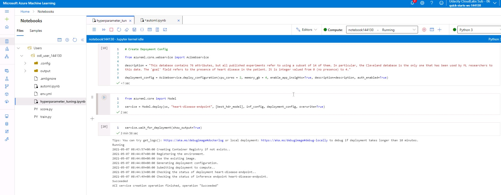
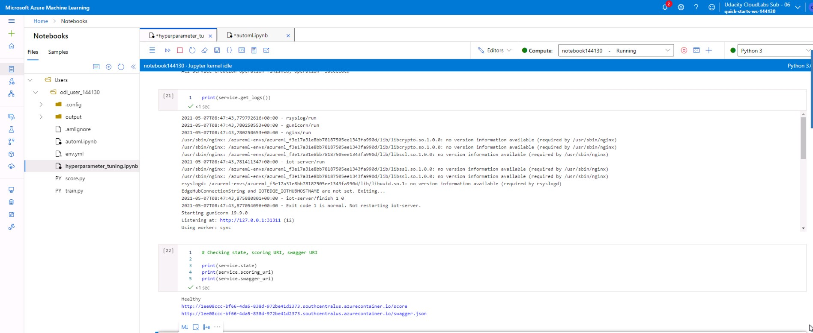
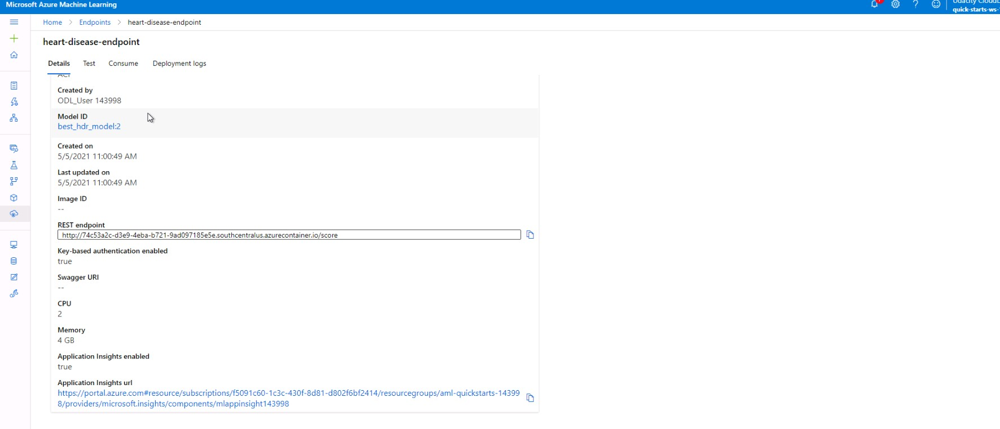
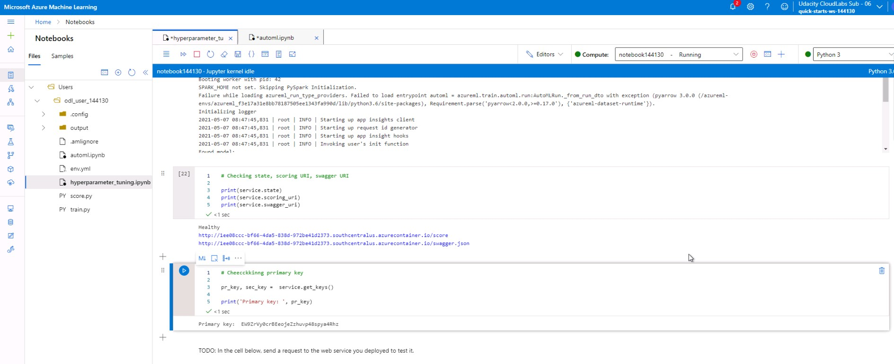
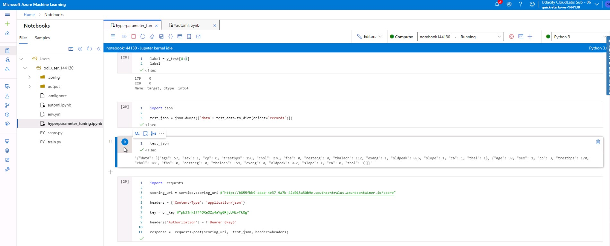

# Udacity ML Engineer with Azure Capstone: Heart Disease Prediction (UCI)

The goal of this project is to productionalize a prediction model for the [Heart Disease dataset from UCI Machine Learning repository](https://archive.ics.uci.edu/ml/datasets/heart+disease). To echieve this, we use two approaches: Azure AutoML to find the best model, and a pre-selected model optimized using Azure Hyperdrive. Then we deploy the model with the best performance.

## Dataset

### Overview
The dataset source if the [Heart Disease dataset from UCI Machine Learning repository](https://archive.ics.uci.edu/ml/datasets/heart+disease). It contains 76 attributes, but all published experiments refer to using a subset of 14 of them. In particular, the Cleveland database is the only one that has been used by ML researchers to
this date.

### Task
The task for this dataset is classification of whether patients have heart disease or not, based on various medical information. To this end we used Accuracy as the primary metric for both approaches.

Following the documentation from UCI: The "goal" field refers to the presence of heart disease in the patient. It is integer valued from 0 (no presence) to 4. Experiments with the Cleveland database have concentrated on simply attempting to distinguish presence (values 1,2,3,4) from absence (value 0).

The 14 used features as follows (with numbers from the original 76 features):

1. #3 (age)
2. #4 (sex)
3. #9 (cp): chest pain type
     - Value 1: typical angina
     - Value 2: atypical angina
     - Value 3: non-anginal pain
     - Value 4: asymptomatic
4. #10 (trestbps): resting blood pressure (in mm Hg on admission to the hospital)
5. #12 (chol): serum cholestoral in mg/dl
6. #16 (fbs): (fasting blood sugar > 120 mg/dl) (1 = true; 0 = false)
7. #19 (restecg): resting electrocardiographic results
    - Value 0: normal
    - Value 1: having ST-T wave abnormality (T wave inversions and/or ST elevation or depression of > 0.05 mV)
    - Value 2: showing probable or definite left ventricular hypertrophy by Estes' criteria
8. #32 (thalach): maximum heart rate achieved
9. #38 (exang): exercise induced angina (1 = yes; 0 = no)
10. #40 (oldpeak): ST depression induced by exercise relative to rest
11. #41 (slope): the slope of the peak exercise ST segment
    - Value 1: upsloping
    - Value 2: flat
    - Value 3: downsloping
12. #44 (ca): number of major vessels (0-3) colored by flourosopy
13. #51 (thal): 3 = normal; 6 = fixed defect; 7 = reversable defect
14. #58 (target) (the predicted attribute): diagnosis of heart disease (angiographic disease status)
    - Value 0: < 50% diameter narrowing
    - Value 1: > 50% diameter narrowing

### Access
We will be using the Cleaveland database, with a label of either 0 or 1 (absence or presence). It has been uploaded to this github repo, and accessed in the Jupyter Notebooks via a raw link to the .csv file.

## Automated ML
In our AutoML run, we first created a workspace and a compute cluster. Afterwards, we checked if the dataset already exists in the workspace registered datasets, and if not we uploaded it from the github raw link to the .csv file. Once uploaded, we converted the dataset to a pandas DataFrame, split it into train & test sets and then converted back to a Tabular Dataset. 

Once our data was ready, we configured the AutoML settings by enabling early stopping (to terminate the run if the performance is not improving), the maximum time per iteration to be 5 minutes (before each iteration terminates), and the maximum concurrent iterations to be 5 (so one per compute cluster node), and finally the maximum cores per iterations was set to use all available cores (with a value f "-1").

The AutoML configuration was set to use the compute cluster we created earlier, maximum minutes that all the iterations combined can take before the expriment termiantes was set to 30. Also, the task was "classification" and the primary metric was selected to be "Accuracy" and the training dataset from above to be used to build the models. Furthermore, we used 5 cross validations, automatic featurization, and enabled Onnx compatible models, as well as outputting the logs to a specified file.

### Results
AutoML found the best performing model to be a VotingEnsemble with a 86.7% accuracy. The below hyperparameters were found using the `get_tags()` method:
```
{'_aml_system_azureml.automlComponent': 'AutoML',
 '_aml_system_ComputeTargetStatus': '{"AllocationState":"steady","PreparingNodeCount":0,"RunningNodeCount":4,"CurrentNodeCount":4}',
 'mlflow.source.type': 'JOB',
 'mlflow.source.name': 'automl_driver.py',
 'ensembled_iterations': '[4, 17, 21, 29, 28, 18, 0]',
 'ensembled_algorithms': "['RandomForest', 'ExtremeRandomTrees', 'LightGBM', 'LightGBM', 'LightGBM', 'LightGBM', 'LightGBM']",
 'ensemble_weights': '[0.1111111111111111, 0.2222222222222222, 0.2222222222222222, 0.1111111111111111, 0.1111111111111111, 0.1111111111111111, 0.1111111111111111]',
 'best_individual_pipeline_score': '0.8570731707317073',
 'best_individual_iteration': '4',
 '_aml_system_automl_is_child_run_end_telemetry_event_logged': 'True',
 'model_explain_run_id': 'AutoML_322483d1-f8f8-42d7-91bf-464cb2ccc095_ModelExplain',
 'model_explanation': 'True'}
```

To improve the performance of the AutoML run and its best model, we could increase the iteration timeout in minutes and the experiment timeout in minutes to approx. 1 or 1.5 hours in order to allow more time for the models to train. We could also use a better primary metric for a slightly imbalaned dataset, like AUC Weighted.

Here we have a screenshot with the run submition output:


Below we can see a screenshot of `RunDetails` widget:


We can also see the output of the `wait_for_completion` method:


A screenshot of the best model run Id and other details:


The best model hyperparameters can be seen in the following screenshot:


In the below screenshot, the best model can also be seen in ML Studio, on the right-hand side unde the Best model summary (in our case, a VotingEnsemble algorithm):


In the next screenshot we see the next page if we click on the best model algorithm name (above). Here, we see details about the best model and its run:


In the following screenshot we have further details on metrics, accessed by click on the Metrics tab (above). We can see charts for Precision-Recall, ROC, as well as key metrics like Accuracy, AUC weighted:


Finally, in the Jupyter Notebook we have registered the best AutoML model. This can be seen in the below screenshot:


Once registering was completed successfully, we can see our registered AutoML model in the Models section of ML Studio. This can be seen in the below screenshot (along with the regitered HyperDrive model):


## Hyperparameter Tuning
In our Hyperdrive optimized run, we also used an ensemble algorithm because of their increased performance on classification tasks, specifically. scikit-learn's RandomForestClassifier. This meta estimator fits a number of decision tree classifiers to sub-samples of the training data. In order to improve accuracy and also control-overfitting, it uses averages of the performances of the fitted decision trees.

We used Azure HyperDrive for Hyperpamater Tunning of this algorithm on the following parameters:
* `n_estimators`: number of estimators, the number of trees in the forest (decision tree estimators fitted to sub-samples). The range of values used was between 100 (default) and 225 with 25 int increments. The reasoning was to increase the ensemble prediction "power" by increasing the number of estimators to a reasonable value, and using not too fine-grain increments; all in order to avoid excessive training times, balanced with improved performane from out-of-the-box model.
* `max_depth`: the maximum depth of each decision tree used. Again, we used the same reasoning to balance performance and reasonable training times, and provided a range of values from 2 to 10 with 2 int increments.
* `min_samples_leaf`: the minimum number of samples per leaf node (splitting at any depth is only considered if it leaves at least this number in each branch). The same reasoning and range of 2 to 10 with 2 int increments was used here as well.


### Results
HyperDrive optimized the model to an Accuracy of 87%, which is higher than the VotingEnsemble found by AutoML, with the below hyperparmaters found with the `get_metrics` method of the best run:

```
{'Number of trees:': 100.0, 'Max depth:': 2, 'Min number of samples at leaf node:': 2, 'Accuracy': 0.87}
```

Since the hyperparameters are quite close to the default ones, in order to improve the performance the parameter space could be increased. Specifically, the number of trees would range from 50 to 250 (at least). Also, AutoML greatly benefits from its Featurization step, and this is something that would help here: adding a Feature Engineering step in the `train.py` script. Lastly, using a better primary metric like AUC Weighted would also be beneficial and, if we allow for more training time, a Grid Search parameter sampling would help with slight impromenets since it's an exhaustive search of the parameter space.

*TODO* Remeber to provide screenshots of the `RunDetails` widget as well as a screenshot of the best model trained with it's parameters.

Below we can see a screenshot of `RunDetails` widget:


The following screenshot shows the tuned hyperparameters and the run Id of the optimized model:


## Model Deployment
Since the HyperDrie optimized RandomForestClassifier had the best Accuracy (87%), we deployed this model. Documentation followed for steps: [Deploy machine learning models to Azure](https://docs.microsoft.com/en-us/azure/machine-learning/how-to-deploy-and-where?tabs=python) 

First, we saved and registered the best model, which can be seen in the following screenshot of the notebook:


As a result, the registered model can be seen in the Models section of ML Studio (along with the registered AutoML model):


Then, we created an Environment with conda dependencies and needed python modules (we also ensured we have an .yml file with all the modules needed in the current working directory). Also, we set-up an Inference Configuration that used the above Environment, and an `score.py` entry script that allows us to load the model and make a prediction with it. This can be seen in the following screenshot:



The final preparation step for the deployment, we used ACI Webservice and its `deploy_configuration` to enable app insights, auathentication and hardware specs. Lastly, we used the workspace, regitered model, inference config and deployment config to do the actual model deployment. We can see the code for this in the below screenshot, along with the output from its `wait_for_deployment` method:


Afterwards, we checked the deployment output, logs and service state to see if the deployment was successful and other info needed for calling the endpoint. This is captured in the below screenshot:


Once the deployment was successful, we can see the details of the active endpoint in the Endpoints section of ML Studio:


In the next screenshot, we can see the same page in ML Studio, but with the scorring URI and App Insights URL of the endpoint:


Again, the following screenshot shows important info needed for calling the endpoint: scoring uri, swagger uri, primary key (and the endpoint state):


Following the [Azure documentation](https://docs.microsoft.com/en-us/azure/machine-learning/how-to-consume-web-service?tabs=python#call-the-service-python), the input data for calling the endpoint was created from the same train-test split, but using the first 2 entries of the test dataset. We read the test dataset and the test labels in `pandas DataFrames`, see below screenshot:


Next, the input data was converted to json format (using "column-name": "value" format" of the 13 features) similar to the above documentation guidelines. Please see below screenshot for this as well as the setp-up for the call (to be explained below):


In order to query the endpoint, we used the scoring URI, the input data, and the Header (which we'll explain shortly) in `post` method of the `requests` python module. To compose the Header of the post we used the primary key as Bearer token in the 'Authentication' section, along with other standard input (like the fact that we are sending a json, converted from a `dict`). The code for the set-up of the endpoint call as awell as its response can be seen in the following screenshot:


## Screen Recording
The following link is for a screencast showcasing the working model, a demo of the deployed model and a demo of the sample request sent to the endpoint and its reponse: [Youtube - Udacity ML Engineer with Azure Capstone](https://www.youtube.com/watch?v=7xlvjv-oX4M)

## Future Improvement Suggestions
For improving the workflow of the project, a more unified approach could be implemented. This means merging both experiment runs (AutoML & HyperDrive) in the same Jupyter Notebook, as this would streamline the workflow. Furtheremore, the preparations like compute clusters, workspace, experiments would only be done or checked once. Also, the data could be read-in, registered, train-test split, prepared as pandas DataFrames, TabularDatasets or jsons (for API calls) only once. We would also have one place to go for comparisons. To build on this, once training is done and the best models and hyperparmaters are found and registered, we could have a procedure to compare performances of the two approaches and deploy the best model of the two, and then do the endpoint call to it using the already split data. Lastly, one more improvement that can be done is to include all these steps in a Pipeline and deploy it as well. This would automate the whole process, following the CI/CD principles of the ML Ops as discussed in the lectures of the course.


## Citations
The names of the principal investigator responsible for the data collection at each institution:
1. Hungarian Institute of Cardiology. Budapest: Andras Janosi, M.D.
2. University Hospital, Zurich, Switzerland: William Steinbrunn, M.D.
3. University Hospital, Basel, Switzerland: Matthias Pfisterer, M.D.
4. V.A. Medical Center, Long Beach and Cleveland Clinic Foundation:Robert Detrano, M.D., Ph.D.